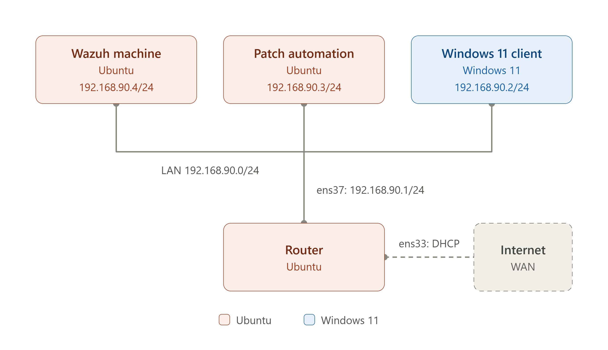

# Wazuh Pre-Approved Vulnerability Auto-Patching Pipeline

A defensive security automation project that connects **Wazuh vulnerability
detection** with a controlled **Ansible patch deployment pipeline**.

The project is designed to use Wazuh to identify vulnerabilities present on monitored systems and automatically patch the affected endpoints when a corresponding **pre-approved patch** is available in the patch repository. The pipeline matches the detected vulnerability with the appropriate approved patch and operating system before deploying the remediation through the patch automation process.


## Architecture

```text
Wazuh Agents
    |
    v
Wazuh Indexer / OpenSearch
    |
    |  wazuh_vulnerability_collect.py
    |  Fetch -> Normalize -> Filter
    v
vulnerabilities.csv
    |
    | SCP
    v
Patch Automation Server
    |
    |  patch_pipeline.py
    v
Approved Patch Repository
    |
    | metadata approval + SHA-256 verification
    v
CVE / OS exact matching
    |
    v
Temporary Ansible Inventory
    |
    v
Ansible Playbook Deployment
    |
    v
Windows / Linux Endpoints
```

## Network Topology

The project uses a simple segmented lab design. Vulnerability information is
collected from the Wazuh Indexer, transferred to a dedicated patch automation
server, and remediation is then pushed only to the endpoints that require an
approved patch.

<p align="center">
  
</p>

### Data flow

1. Wazuh agents report endpoint and vulnerability state to the Wazuh platform.
2. `wazuh_vulnerability_collect.py` queries the Wazuh Indexer over HTTPS and
   creates `vulnerabilities.csv`.
3. The CSV is transferred to the patch automation server using SCP.
4. `patch_pipeline.py` compares each finding against the pre-approved patch
   repository and creates a patch queue for exact CVE/OS matches.
5. The patch automation server exposes approved patch files to managed hosts
   over its patch-server port when deployment begins.
6. Ansible connects to Windows targets through WinRM and Linux targets through
   SSH to execute the required remediation playbook.

## What the two scripts do

### `wazuh_vulnerability_collect.py`

1. Connects to the Wazuh Indexer/OpenSearch API.
2. Retrieves vulnerability documents from `wazuh-states-vulnerabilities-*`.
3. Normalizes Wazuh fields into a simple record containing hostname, OS, CVE,
   severity, package and installed version information.
4. Filters findings by configured severity and package exclusion rules.
5. Exports the actionable findings to `vulnerabilities.csv`.
6. Copies the CSV to the patch automation server over SCP.

### `patch_pipeline.py`

1. Scans the approved patch repository for `metadata.json` files.
2. Rejects packages that are not marked `APPROVED`.
3. Re-checks the SHA-256 checksum of approved patch files when a checksum is
   present.
4. Builds a CVE-to-patch catalog.
5. Matches Wazuh findings to approved patches using the CVE and OS.
6. Skips findings already reporting the fixed version.
7. Groups affected hosts by playbook.
8. Generates a temporary Ansible inventory.
9. Runs the matching Ansible playbook against only the required endpoints.
10. Checks the Ansible recap before treating a deployment as successful.

## Safety controls built into the design

- **Pre-approval gate:** only repository entries with `APPROVED` status enter
  the patch catalog.
- **Checksum validation:** approved packages can be verified with SHA-256 before
  deployment.
- **Exact CVE matching:** no fuzzy or AI-based decision is used to select a
  patch.
- **OS validation:** a Windows patch is not matched to an Ubuntu finding, and
  vice versa.
- **Fixed-version check:** already-remediated findings can be skipped.
- **Scoped deployment:** hosts are grouped only for the specific playbook they
  require.
- **No secrets in source:** credentials are read from environment variables.

## Environment Setup

Before running the project, you must first build the required lab or production environment and deploy the scripts to the appropriate systems.

The environment should include a Wazuh Server/Indexer, a Patch Automation Server, and one or more Windows or Linux endpoints that will be monitored and patched.

Install the wazuh_vulnerability_collect.py script on the system that has access to the Wazuh Indexer. This script is responsible for collecting vulnerability information, filtering the results, generating the vulnerabilities.csv file, and transferring it to the Patch Automation Server.

Install the patch_pipeline.py script on the Patch Automation Server. This system should also contain the approved patch repository and Ansible configuration required to deploy patches to the target endpoints.

The target endpoints must be configured so that the Patch Automation Server can communicate with them using the appropriate management protocol, such as SSH for Linux systems or WinRM for Windows systems.

After the environment has been created, configure the scripts with the correct IP addresses, credentials, paths, and environment-specific settings before executing the automation workflow.

## Running the pipeline

### 1. Collect Wazuh vulnerabilities

On the Wazuh-side machine:

```bash
python3 wazuh_vulnerability_collect.py
```

This creates `vulnerabilities.csv` and sends it to the configured patch
machine.

### 2. Run the approved patch pipeline

On the patch automation machine:

```bash
python3 patch_pipeline.py
```

The script builds the approved catalog, creates `patch_queue.csv`, and runs the
required Ansible playbooks.

## Disclaimer

Use this project only in environments where you are authorized to administer
and patch the target systems. Test patches in a lab or staging environment
before production deployment.
